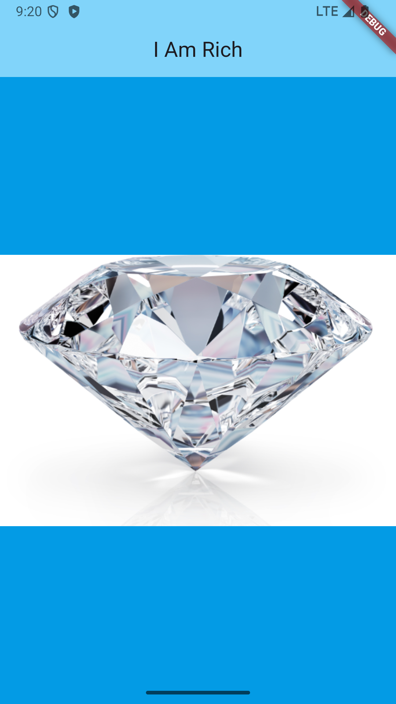

#  Flutter de A à Z
## De Débutant à Développeur Pro

Bienvenue dans le dépôt officiel de ma playlist YouTube **Flutter de A à Z**.

L'objectif de cette série est simple : apprendre Flutter progressivement, en partant de zéro, à travers des projets pratiques.

Chaque nouveau projet nous permet de découvrir de nouveaux widgets, de nouveaux concepts et de meilleures façons de construire des applications Flutter.

> 📺 **Playlist YouTube :** [Flutter de A à Z](https://www.youtube.com/playlist?list=PLES6tbIw8xm4COsQFGLs1DyRBEzIbzBTO&si=OBOyKz1rMXtDl5Er)

---

# 🎯 Objectif de la série

À travers cette formation, nous allons progressivement apprendre à :

- comprendre le fonctionnement de Flutter et Dart ;
- construire des interfaces avec les widgets Flutter ;
- organiser nos interfaces avec `Row`, `Column`, `Container`, etc. ;
- travailler avec les assets, images et polices ;
- comprendre le Widget Tree ;
- utiliser Android Studio et Visual Studio Code ;
- tester nos applications sur émulateur et téléphone physique ;
- gérer l'état de nos applications ;
- utiliser des APIs ;
- travailler avec Firebase ;
- structurer correctement nos projets ;
- utiliser Git et GitHub ;
- intégrer progressivement des outils d'IA dans notre workflow ;
- préparer et publier de vraies applications.

L'objectif n'est pas simplement de copier du code.

👉 **Nous voulons comprendre ce que nous écrivons et pourquoi nous l'écrivons.**

---

# 📚 Les projets

Chaque projet introduit progressivement de nouvelles notions Flutter.

---

## 💎 01 — I Am Rich

Notre toute première application Flutter.

Ce projet nous permet de découvrir les bases de Flutter et de comprendre comment une application est construite.

### Ce que nous apprenons

- `main()`
- `runApp()`
- `MaterialApp`
- `Scaffold`
- `AppBar`
- `Center`
- `Text`
- `Image`
- Widget Tree
- Assets
- `pubspec.yaml`
- `Image.asset`
- couleurs Material
- icône de l'application
- installation de l'application sur un téléphone Android physique

<p align="center">
  
</p>

---

## 🔜 Prochains projets

D'autres applications seront ajoutées progressivement au fur et à mesure de l'avancement de la playlist.

Chaque projet aura son propre dossier avec :

- son code de départ ;
- son code final ;
- ses assets ;
- ses captures d'écran ;
- son README ;
- les ressources nécessaires pour suivre les vidéos.

---

# 🧑‍💻 Comment utiliser ce dépôt ?

Vous avez deux possibilités.

## Option 1 — Télécharger le projet

Sur GitHub :

```text
Code
↓
Download ZIP
```

Décompressez ensuite le fichier et ouvrez le projet souhaité avec **VS Code** ou **Android Studio**.

---

## Option 2 — Cloner le dépôt avec Git

Si Git est installé sur votre machine :

```bash
git clone LIEN_DE_TON_DEPOT
```

Entrez ensuite dans le dépôt :

```bash
cd flutter-de-a-a-z
```

Puis dans le projet que vous souhaitez utiliser.

Par exemple :

```bash
cd projects/i_am_rich/starter-code
```

Récupérez les dépendances Flutter :

```bash
flutter pub get
```

Puis lancez l'application :

```bash
flutter run
```

Et voilà. 🚀

---

# ⚙️ Prérequis

Avant de lancer les projets, assurez-vous d'avoir :

- Flutter installé ;
- Dart installé avec Flutter ;
- VS Code ou Android Studio ;
- Git si vous souhaitez cloner le dépôt ;
- un émulateur Android ou un téléphone physique configuré.

Vous pouvez retrouver toute la configuration nécessaire dans les premières vidéos de la playlist **Flutter de A à Z**.

---

# 📌 Starter Code vs Final Code

Pour plusieurs projets, vous trouverez deux versions.

### `starter-code`

C'est le point de départ utilisé au début de la leçon.

Vous pouvez partir de cette version et coder avec moi pendant la vidéo.

### `final-code`

C'est le résultat obtenu à la fin du projet ou de la section.

Il peut être utile si :

- vous avez une erreur ;
- vous voulez comparer votre code ;
- vous avez raté une partie de la vidéo ;
- vous voulez simplement voir le résultat final.

> 💡 Je vous recommande toutefois d'essayer de construire le projet vous-même avant de regarder le code final.

---

# 🧠 Une erreur n'est pas un échec

Vous allez rencontrer des erreurs.

Beaucoup. 😄

Gradle va parfois vous fatiguer.

Flutter va parfois vous afficher un message de trois kilomètres pour une virgule oubliée.

C'est normal.

Apprendre à comprendre et résoudre ces erreurs fait partie du développement.

---

# 🤝 Contributions

Vous suivez la série et vous avez :

- trouvé une erreur ;
- amélioré une explication ;
- corrigé un bug ;
- ou une suggestion intéressante ?

Vous pouvez ouvrir une **Issue** ou proposer une **Pull Request**.

---

# 📺 Suivre la formation

🎬 **YouTube : Flutter de A à Z — De Débutant à Développeur Pro**

👉 [Regarder la playlist complète](https://www.youtube.com/playlist?list=PLES6tbIw8xm4COsQFGLs1DyRBEzIbzBTO&si=OBOyKz1rMXtDl5Er)

Si cette série vous aide, pensez à :

⭐ mettre une étoile au dépôt ;  
👍 aimer les vidéos ;  
📢 partager la playlist ;  
🔔 vous abonner pour suivre les prochains projets.

---

# 👨‍💻 Auteur

**Ousmanou**

Développeur Flutter & créateur de contenu tech.

Je partage mon apprentissage, mes projets et des contenus autour du développement logiciel, de Flutter et des technologies qui permettent de construire des produits utiles.

### Me retrouver

- 🎥 [YouTube](https://www.youtube.com/@Ous_manou)
- 💼[ LinkedIn](https://www.linkedin.com/in/ous-manou/)
- 💼[ Twitter/X](https://x.com/ous_manou)
- 💼[ Facebook](https://web.facebook.com/ous3310)

---

# ⭐ Soutenir le projet

Si cette série vous aide dans votre apprentissage de Flutter, vous pouvez simplement laisser une ⭐ sur ce repository.

Cela m'aide à savoir que ce contenu est utile et me motive à continuer à enrichir la série.

---

<p align="center">
  <b>Flutter de A à Z 🚀</b><br>
  Apprendre • Comprendre • Construire
</p>

### 📂 Code source

✅ [Voir le code final](https://github.com/OusmanouMamoudou/FlutterA-Z/tree/master/projects/i_am_rich)

---
