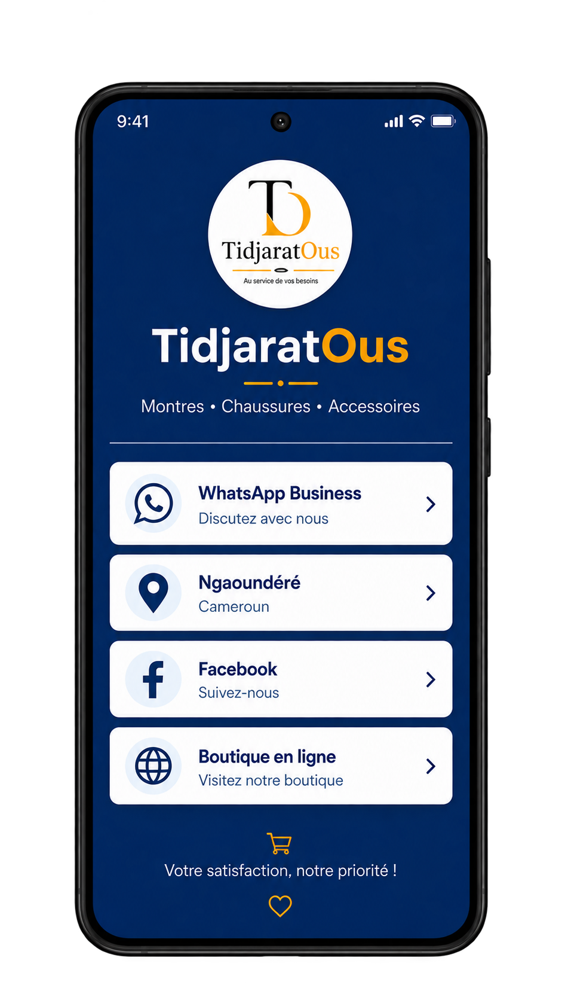

#  TidjaratOus Card

**TidjaratOus Card** est le deuxième projet pratique de la série YouTube **Flutter de A à Z**.

Après avoir découvert les bases de Flutter avec **I Am Rich**, nous allons maintenant apprendre à construire et organiser une véritable interface grâce aux **widgets de mise en page de Flutter**.

L'objectif est de créer progressivement une **carte de visite numérique** pour **TidjaratOus**, contenant notamment le logo de la boutique, ses coordonnées, sa localisation, ses réseaux sociaux et différentes informations de contact.

<p align="center">
  
</p>

---

##  Ce que nous allons apprendre

À travers ce projet, nous allons notamment découvrir :

- Hot Reload et Hot Restart
- `Container`
- `Column`
- `Row`
- `CircleAvatar`
- `Text`
- les polices personnalisées
- les Material Icons
- `SizedBox`
- les couleurs
- `Card`
- `ListTile`
- l'organisation des widgets dans une interface Flutter
- la construction progressive d'une interface à partir d'un design


---

##  Utiliser le Starter Code

### 1. Clonez le dépôt

```bash
git clone https://github.com/OusmanouMamoudou/FlutterA-Z.git
```

### 2. Accédez au Starter Code de TidjaratOus Card

```bash
cd FlutterA-Z/projects/02-tidjaratous-card/starter-code
```

### 3. Installez les dépendances

```bash
flutter pub get
```

### 4. Lancez l'application

```bash
flutter run
```

---

##  Prérequis

Avant de commencer ce projet, assurez-vous d'avoir :

- Flutter installé ;
- VS Code ou Android Studio configuré ;
- un émulateur Android ou un téléphone physique prêt à être utilisé ;
- suivi les premières vidéos de la série afin de comprendre les bases abordées dans **I Am Rich**.

Les étapes d'installation et de configuration sont expliquées dans les premières vidéos de la playlist **Flutter de A à Z**.

---

##  Vidéos du projet

Ce projet sera construit progressivement à travers plusieurs épisodes de la série **Flutter de A à Z**.

Les liens vers les différentes vidéos seront ajoutés ici au fur et à mesure de leur publication.

👉 [Regarder la playlist Flutter de A à Z](https://www.youtube.com/playlist?list=PLES6tbIw8xm4COsQFGLs1DyRBEzIbzBTO)

---

## 📁 Structure

```text
02-tidjaratous-card/
│
├── README.md
│
├── starter-code/
│   ├── android/
│   ├── lib/
│   │   └── main.dart
│   ├── web/
│   ├── pubspec.yaml
│   └── ...
│
└── final-code/
    └── ...
```

Le dossier `starter-code/` contient le point de départ utilisé au début du projet.

Le dossier `final-code/` contiendra l'application terminée une fois le projet achevé.

> Les dossiers et fichiers générés automatiquement comme `build/` ou `.dart_tool/` ne sont pas versionnés dans le dépôt.

---

##  Pour les débutants

Je vous recommande de partir du **Starter Code** et de construire l'application progressivement en suivant les vidéos.

Évitez de chercher directement la solution finale.

L'objectif n'est pas seulement d'obtenir la même interface, mais surtout de comprendre **pourquoi et comment chaque widget est utilisé**.

Une fois le projet terminé, vous pourrez comparer votre implémentation avec le code final disponible dans ce dépôt.

---

<p align="center">
  <b>Flutter de A à Z 🚀</b><br>
  Comprendre • Construire • Accélérer avec l'IA
</p>
